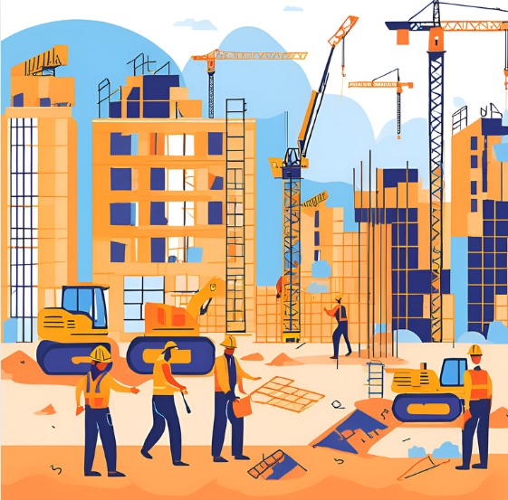

# Projeto EBOOK Gerado por I.A.s
Projeto com o objetivo de gerar um ebook digital com as facilidades das ferramentas de IA. todos os prompts
seguem abaixo.

## 💻 Tecnologias utilizadas no projeto
- [ChatGPT](https://chat.openai.com/) 
- [Canva](https://www.canva.com/)
- [PowerPoint](https://www.microsoft.com/en/microsoft-365/powerpoint)

  ## 🧠 Prompts

ChatGPT

|   Ação   | prompt: 

Canva

|  Ação  | prompt:

## ✨ Features

- Conteúdo gerado via ChatGPT
- Imagens geradas via Canva

## 📚 Materiais

- Imagens utilizadas em `Capa`
- Ebook gerado em `Ebook Bootcamp`

## 🛠️ Instruções de execução

Utilizado os prompts acima nas ferramentas para gerar o material base, utilizando ferramenta de edição de documentos power point e libreoffice.
